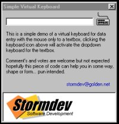



## Virtual Keyboard

### Description

This code demonstrates how you can create a virtual keyboard that can be toggled on or off for data entry purposes, could be of use in game/application software.

I hope it proves to be of some use, votes and comments welcomed but not expected.
 
### More Info
 

             |
---                |---
**Submitted On**   |2001-01-10 18:02:12
**By**             |[Jonathan Roach](https://github.com/Planet-Source-Code/PSCIndex/blob/master/ByAuthor/jonathan-roach.md)
**Level**          |Beginner
**User Rating**    |4.5 (36 globes from 8 users)
**Compatibility**  |VB 5\.0, VB 6\.0
**Category**       |[Miscellaneous](https://github.com/Planet-Source-Code/PSCIndex/blob/master/ByCategory/miscellaneous__1-1.md)
**World**          |[Visual Basic](https://github.com/Planet-Source-Code/PSCIndex/blob/master/ByWorld/visual-basic.md)
**Archive File**   |[CODE\_UPLOAD136081102001\.zip](https://github.com/Planet-Source-Code/jonathan-roach-virtual-keyboard__1-14301/archive/master.zip)

